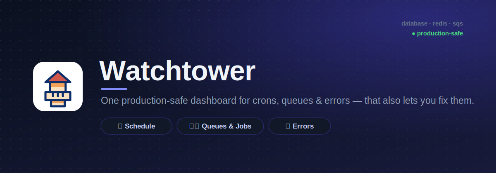
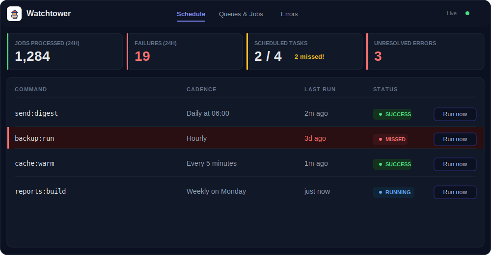
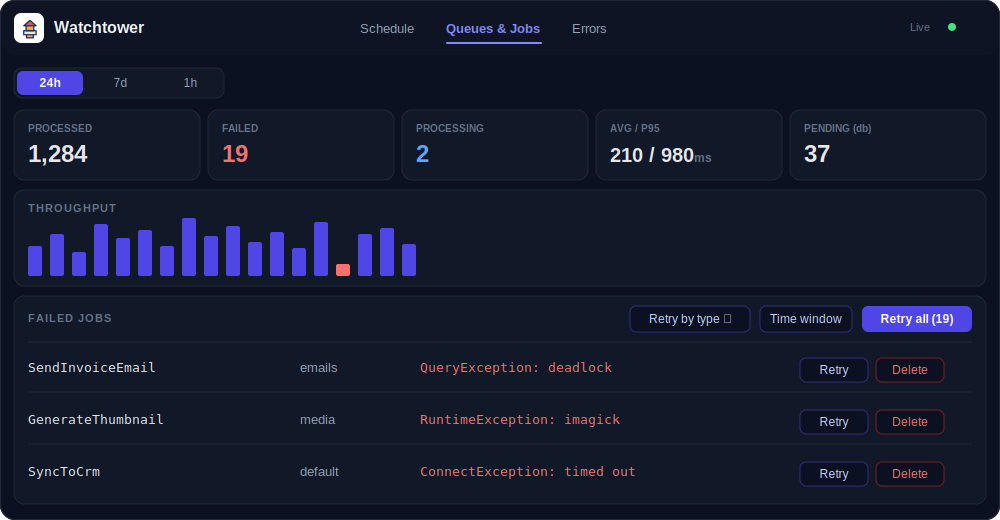
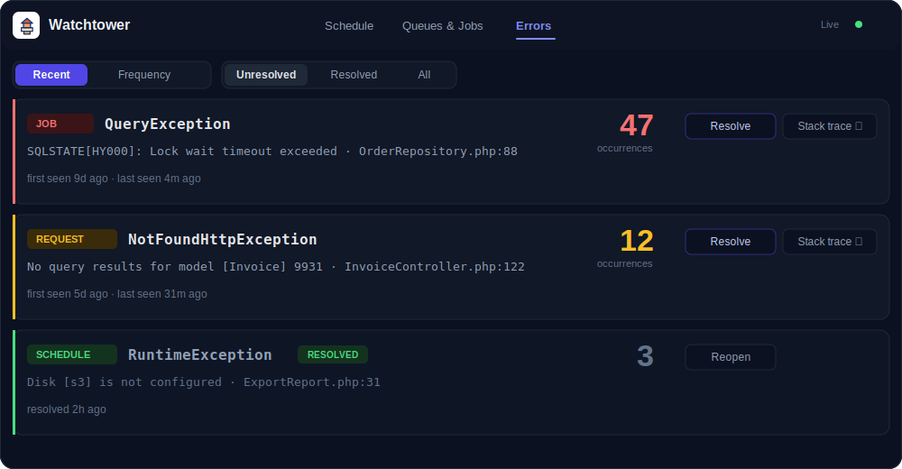

# Watchtower

> One production-safe dashboard for everything happening in the background of your Laravel app — scheduled tasks, queues & jobs, and errors — that also lets you **fix them**. Works with **any** queue driver (database, Redis, SQS). No Redis required.

<p align="center">
  
</p>

<p align="center">
  <a href="https://github.com/Devifyo/watchtower/actions"></a>
  
  
  <a href="LICENSE"></a>
</p>

<!-- TODO: replace art/hero.svg with an animated hero.gif of the live dashboard -->

---

## 🤔 Why Watchtower?

Laravel already ships excellent observability tools — so why another one? Because most of them either can't be left on in production, are locked to a single queue driver, or only let you *look* at problems instead of *fixing* them. Watchtower is built to live in production permanently, work no matter how your queues are configured, and turn the dashboard into a control panel.

**Why not Telescope / Horizon / Pulse?**

| Capability | Watchtower | Horizon | Telescope | Pulse |
|---|:---:|:---:|:---:|:---:|
| Production-safe (leave it on) | ✓ | ✓ | ✗ | ✓ |
| Works without Redis / any driver | ✓ | ✗ (Redis-only) | ✓ | ✓ |
| Scheduled-task + missed-run monitoring | ✓ | ✗ | ✗ | ✗ |
| Bulk failed-job retry (by type / time window) | ✓ | ✓ | ✗ | ✗ |
| Built-in error tracker with resolve | ✓ | ✗ | ✗ | ✗ |
| Compiled dashboard (no host frontend deps) | ✓ | ✓ | ✓ | ✓ |

> These tools are **complementary, not strictly competitors**. Horizon is unmatched for deep Redis queue throughput, Telescope is a fantastic local debugger, and Pulse gives you a great application health overview. Watchtower fills the gap in between: a single, always-on, driver-agnostic place to watch crons, queues and errors — and act on them.

---

## ✅ Requirements

- **PHP** 8.2+
- **Laravel** 11.x or 12.x

---

## 📦 Installation in 2 commands

```bash
composer require devifyo/watchtower
php artisan watchtower:install
```

`watchtower:install` publishes the config file, publishes the dashboard assets, and runs the migrations for you. The **compiled dashboard assets ship inside the package** (served straight from its `dist/` directory), so there is **no `npm install` or build step** in your host application.

**Zero-config first run:** once installed, just visit:

```
https://your-app.test/watchtower
```

Out of the box the dashboard is accessible in your **local** environment with no extra setup. (See [Security](#-security) before exposing it in production.)

---

## 🚀 Usage

Open `/watchtower` and you get a single-page dashboard with a summary bar across the top and three tabs:

- **📅 Schedule** — every scheduled task, its cron expression (in plain English), last run, duration, status, and whether an expected run was **missed**. Hit **Run now** to dispatch any task on demand without waiting for the next tick.
- **⚙️ Queues & Jobs** — live queue metrics plus the failed-jobs table. **Retry** a single failed job, **delete** it, or **bulk-retry** — including filtering by **exception type** or a **time window** so you can re-run only the jobs from that bad deploy.
- **🐛 Errors** — every captured exception, grouped and counted, with the full stack trace and request/job context. Mark an error **resolved** once you've shipped a fix, or **reopen** it if it comes back.

The **summary bar** keeps the headline numbers — recent failures, missed schedules, open errors — in view at all times, and the dashboard polls for fresh data automatically (interval is configurable).

---

## 🖼️ Screenshots

_Previews below are illustrative; replace with real screenshots of your running dashboard at `/watchtower`._

**📅 Schedule** — scheduled tasks with missed-run detection and run-now
<p></p>

**⚙️ Queues & Jobs** — queue metrics and bulk failed-job retry
<p></p>

**🐛 Errors** — exception tracker with resolve / reopen
<p></p>

---

## ⚙️ Configuration

After installing, the config file lives at `config/watchtower.php`. Every option is environment-overridable.

| Key | Description | Default | Env var |
|---|---|---|---|
| `enabled` | Master switch. When off, nothing is recorded (repository becomes a no-op) but the dashboard still renders historical data. | `true` | `WATCHTOWER_ENABLED` |
| `path` | URI prefix the dashboard + JSON API are served from. | `watchtower` | `WATCHTOWER_PATH` |
| `domain` | Optionally scope all routes to a subdomain. | `null` | `WATCHTOWER_DOMAIN` |
| `middleware` | Middleware stack every route runs through (the `Authorize` middleware is appended automatically). | `['web']` | — |
| `connection` | Dedicated DB connection for Watchtower's tables so its writes never contend with app traffic. `null` = default connection. | `null` | `WATCHTOWER_DB_CONNECTION` |
| `table_prefix` | Namespaces every table Watchtower creates. | `watchtower_` | `WATCHTOWER_TABLE_PREFIX` |
| `recording.schedule` | Record scheduled-task runs. | `true` | `WATCHTOWER_RECORD_SCHEDULE` |
| `recording.queue` | Record queue/job activity. | `true` | `WATCHTOWER_RECORD_QUEUE` |
| `recording.exceptions` | Record exceptions. | `true` | `WATCHTOWER_RECORD_EXCEPTIONS` |
| `writes.after_response` | Defer writes to the framework's `terminating()` callback so request/job latency is untouched. `false` writes inline. | `true` | `WATCHTOWER_AFTER_RESPONSE` |
| `sampling.rate` | Fraction of records stored (`1.0` = everything, `0.1` = ~10%). Failures and schedule runs are **always** recorded regardless. | `1.0` | `WATCHTOWER_SAMPLING_RATE` |
| `retention.schedule` | Days to keep schedule runs before `watchtower:prune` deletes them. | `30` | `WATCHTOWER_RETAIN_SCHEDULE` |
| `retention.queue` | Days to keep queue/job records. | `7` | `WATCHTOWER_RETAIN_QUEUE` |
| `retention.exceptions` | Days to keep exception records. | `30` | `WATCHTOWER_RETAIN_EXCEPTIONS` |
| `limits.trace` | Max bytes stored for a stack trace. | `16384` | `WATCHTOWER_LIMIT_TRACE` |
| `limits.payload` | Max bytes stored for a job payload. | `8192` | `WATCHTOWER_LIMIT_PAYLOAD` |
| `limits.output` | Max bytes stored for command/task output. | `8192` | `WATCHTOWER_LIMIT_OUTPUT` |
| `limits.message` | Max bytes stored for an exception message. | `2048` | `WATCHTOWER_LIMIT_MESSAGE` |
| `limits.store_payload` | Set to `false` to **never** persist job payloads (for apps with sensitive job data). | `true` | `WATCHTOWER_STORE_PAYLOAD` |
| `ignore.jobs` | Fully-qualified job class names to skip entirely. | `[]` | — |
| `ignore.commands` | Command signatures to skip entirely. | `[]` | — |
| `ignore.exceptions` | Fully-qualified exception class names to skip entirely. | `[]` | — |
| `dashboard.polling_interval` | Dashboard auto-refresh interval, in milliseconds. | `5000` | `WATCHTOWER_POLL_INTERVAL` |
| `dashboard.per_page` | Rows per page in the dashboard tables. | `25` | `WATCHTOWER_PER_PAGE` |
| `alerts.enabled` | Master switch for alert notifications (off by default). | `false` | `WATCHTOWER_ALERTS_ENABLED` |
| `alerts.channels.slack` | Slack incoming-webhook URL. | `null` | `WATCHTOWER_SLACK_WEBHOOK` |
| `alerts.channels.webhook` | Generic webhook URL to POST alerts to. | `null` | `WATCHTOWER_WEBHOOK_URL` |
| `alerts.channels.mail` | Comma-separated list of email recipients. | `[]` | `WATCHTOWER_ALERT_MAIL` |
| `alerts.on.schedule_failed` | Alert when a scheduled task fails. | `true` | — |
| `alerts.on.schedule_missed` | Alert when an expected scheduled run is missed. | `true` | — |
| `alerts.on.failed_jobs_threshold` | Alert when failed jobs cross the threshold. | `true` | — |
| `alerts.failed_jobs.threshold` | Number of failed jobs that triggers an alert. | `25` | `WATCHTOWER_FAILED_THRESHOLD` |
| `alerts.failed_jobs.window_minutes` | Time window the threshold is measured over. | `60` | `WATCHTOWER_FAILED_WINDOW` |

---

## 🛡️ Production safety

Watchtower is designed to be **left on in production**. Here's how it stays out of your hot path and keeps your database bounded:

- **After-response / deferred writes** — with `writes.after_response` (default `true`), metrics are written in the framework's `terminating()` callback, so request and job latency are untouched.
- **Sampling** — set `sampling.rate` below `1.0` to store only a fraction of records on high-traffic apps. Failures and schedule runs are **always** recorded, so you never miss the things that matter.
- **Truncation** — every stored field is capped via `limits.*` (trace, payload, output, message) to bound row size.
- **Separate connection** — point `connection` at a dedicated database so Watchtower's writes never contend with your application's traffic.
- **Bounded retention + pruning** — old records are deleted per `retention.*`. Schedule the prune command to run daily:

  ```php
  // routes/console.php (Laravel 11/12) or app/Console/Kernel.php
  $schedule->command('watchtower:prune')->daily();
  ```

- **Global kill switch** — set `WATCHTOWER_ENABLED=false` to stop all recording instantly. The dashboard still renders historical data.
- **Ignore lists** — silence noisy or expected items with `ignore.jobs`, `ignore.commands`, and `ignore.exceptions`.
- **Redact sensitive payloads** — set `limits.store_payload=false` to never persist job payloads at all.

---

## 🔒 Security

The dashboard **and** the JSON API run behind the middleware stack you configure (default `['web']`) **plus** an `Authorize` middleware that checks a `viewWatchtower` gate. The gate defaults to allowing **only the local environment** — the same pattern Horizon and Telescope use — so the dashboard is **never accidentally public** in production.

To grant access in production, define the gate in a service provider (e.g. `app/Providers/AppServiceProvider.php`):

```php
use Illuminate\Support\Facades\Gate;

public function boot(): void
{
    Gate::define('viewWatchtower', function ($user) {
        return $user !== null && $user->isAdmin();
    });
}
```

Or use the fluent `Watchtower::auth()` callback, which takes precedence over the gate:

```php
use Watchtower\Watchtower;

public function boot(): void
{
    Watchtower::auth(fn ($request) => $request->user()?->isAdmin());
}
```

Either way, any request that fails authorization gets a `403` — there is no path to the dashboard or API without passing the gate.

---

## 🔔 Alerts (optional)

Alerts are **off by default**. When enabled, Watchtower sends notifications when something needs your attention. They're implemented as standard **Laravel notifications**, so they slot into your existing setup.

**Channels** (each independent — configure any combination):

- **Slack** — incoming-webhook URL via `WATCHTOWER_SLACK_WEBHOOK`
- **Generic webhook** — POST alerts anywhere via `WATCHTOWER_WEBHOOK_URL`
- **Mail** — comma-separated recipients via `WATCHTOWER_ALERT_MAIL`

**Triggers:**

- A **scheduled task fails** (`alerts.on.schedule_failed`)
- A scheduled run is **missed** (`alerts.on.schedule_missed`)
- **Failed jobs cross a threshold** (`alerts.on.failed_jobs_threshold`) — default 25 failures within a 60-minute window, tunable via `WATCHTOWER_FAILED_THRESHOLD` and `WATCHTOWER_FAILED_WINDOW`

Enable alerts and run the monitor on a schedule:

```dotenv
WATCHTOWER_ALERTS_ENABLED=true
WATCHTOWER_SLACK_WEBHOOK=https://hooks.slack.com/services/XXX/YYY/ZZZ
```

```php
$schedule->command('watchtower:monitor')->everyFiveMinutes();
```

---

## 🛠️ Artisan commands

| Command | Description |
|---|---|
| `watchtower:install` | Publish config & assets and run migrations. `--force` overwrites existing published files. |
| `watchtower:prune` | Delete records older than the configured retention windows. `--hours=` overrides every retention window with the given number of hours. |
| `watchtower:monitor` | Evaluate alert conditions and dispatch notifications. Schedule it (e.g. every five minutes). |

---

## 🧪 Testing

```bash
composer test
```

The suite runs on **Pest** with **Orchestra Testbench**.

---

## 🤝 Contributing

Contributions are welcome! Please open an issue to discuss substantial changes first, then send a PR. See [CONTRIBUTING.md](CONTRIBUTING.md) for guidelines. Bug reports, docs improvements, and pull requests are all appreciated.

---

## 📄 License

Watchtower is open-source software licensed under the [MIT license](LICENSE).
